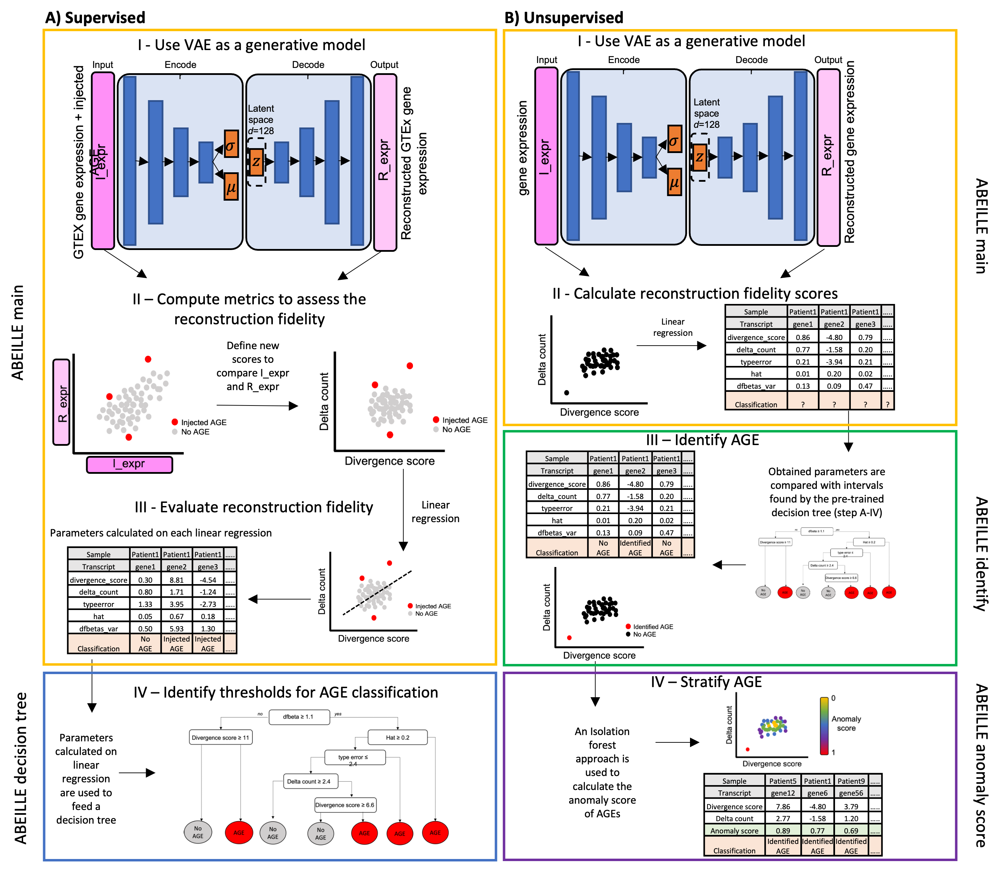

# ABEILLE (ABerrant Expression Identification empLoying machine LEarning)

## Overview

ABEILLE (ABerrant Expression Identification empLoying machine LEarning from sequencing data) is a variational autoencoder (VAE) based method for the identification of AGEs from the analysis of RNA-seq data without the need of replicates or a control group. ABEILLE combines the use of a VAE, able to model any data without specific assumptions on their distribution, and a decision tree to classify genes as AGE or non-AGE. An anomaly score is associated to each gene in order to stratify AGE by severity of aberration. We tested ABEILLE on semi-synthetic and an experimental dataset demonstrating the importance of the flexibility of the VAE configuration to identify potential pathogenic candidates. 
This document will walk the user through different aspect of the ABEILLE package explaining the functionalities and how to install the package.

## Code structure

* [`R/`](R/):
    * [`AddOutriderAGE.R`](R/AddOutriderAGE.R): Injects AGE (Aberrant Gene Expression) in the raw count.
    * [`DataIntegrity.R`](R/DataIntegrity.R): Verify the conformity of the data.
    * [`DeltaCount.R`](R/DeltaCount.R): It measures the divergence between the reconstructed values for each gene by the VAE and the original values.
    * [`DivergenceScore.R`](R/DivergenceScore.R): It measures the divergence between the reconstructed values for each gene by the VAE and the original values.
    * [`IdentifyAGE.R`](R/IdentifyAGE.R): Using successively linear regression and decision tree, this function is able to pick AGEs from two metric dataset. Originally built to work with the divergence score and the delta count, it is possible to feed the function with other metrics. The decision tree can be also customized.
    * [`RemoveZeroCounts.R`](R/RemoveZeroCounts.R): To filter out all the genes with low count or not expressed in all the patients.
    * [`StatsPred.R`](R/StatsPred.R): Print in the console different statistics of the absolute error between the two datasets provided.
    * [`my_tree.R`](R/my_tree.R): The decision tree gives the intervals of the regression parameters to classify the genes expression as AGE (Aberrant Gene Expression) or NGE (Normal Gene Expression). Once calculated, these intervals can be used on unlabeled datasets to classify gene expression by comparing reconstructed counts by the VAE with the input gene counts through the linear regression model.
    * [`SizeFactors.R`](R/SizeFactors.R): Estimate the size factor of each samples by using DESeq2 estimateSizeFactors function.
* [`data/`](data/):
    * [`ExampleAbeilleDataSet.rda`](data/ExampleAbeilleDataSet.rda): Toy dataset to containing 14000 randomly selected sample.
    * [`ExampleAbeilleReconstructed.rda`](data/ExampleAbeilleReconstructed.rda): Reconstruction of the 14000 randomly selected sample.
* [`vignettes/`](vignettes/):
    * [`How-to-use-ABEILLE.Rmd`](vignettes/How-to-use-ABEILLE.Rmd): the vignette explaining the how to work with the package.
    * [`How-to-use-ABEILLE.md`](vignettes/How-to-use-ABEILLE.md): the vignette explaining the how to work with the package.
* [`ABEILLE_1.0.0.tar.gz`](https://github.com/uca-mdlab/ABEILLE/ABEILLE_1.0.0.tar.gz): The archive that is used to install the package.
* [`abeille.py`](https://github.com/uca-mdlab/ABEILLE/abeille.py): Variational autoencoder model used to get the reconstructed data.


## Workflow
The workflow of ABEILLE includes a supervised and an unsupervised part having different step.

### Supervised phase

**1. ABEILLE main**

The purpose of this phase is to determine the thresholds of parameters implemented in ABEILLE model to discriminate aberrant gene expression (AGE) respect to normal gene expression (NGE). For this phase we use two modules: ABEILLE main and ABEILLE decision tree. Hence, a labeled dataset with known AGE must be used. In absence of that, as it is the case for us, a semi-synthetic dataset can be built.

**2. ABEILLE decision tree**

The decision tree gives the intervals of the regression parameters to classify the genes expression as AGE (Aberrant Gene Expression) or NGE (Normal Gene Expression). Once calculated, these intervals can be used on unlabeled datasets to classify gene expression by comparing reconstructed counts by the VAE with the input gene counts through the linear regression model.

### Unsupervised phase 

The unsupervised phase can be run once obtained the aberration intervals through the supervised phase. Alternatively, the aberration intervals found in this study can be used without re-running the supervised phase. The unsupervised phase allows to classify gene expression on unlabeled datasets. 

**1. ABEILLE main**

This is the first step where we run the VAE and the linear regression model on unlabeled dataset in order to calculate the regression parameters on the values of divergence score and delta count obtained by comparing I_expr (Input expression) and R_expr (Reconstructed expression).

**2. ABEILLE identify**

The decision tree calculated in the supervised phase lead us the intervals of regression parameters to classify gene expression as AGE or NGE. During this step, the regression parameters calculated by ABEILLE main on the unlabeled dataset are compared to the intervals obtained with ABEILLE decision tree. This allow to classify gene expression as AGE or NGE based on the regression parameters.

**3. ABEILLE anomaly score**

we employed an isolation forest approach which works using decision trees. They are implemented in an unsupervised fashion as there are no pre-defined labels. Each observation, i.e. a pair of divergence score - delta count, is given an anomaly score. A score close to 1 indicates anomalies, score smaller than 0.5 indicates normal observations.



## Installation and Dependencies

This section explains how to install the ABEILLE package in your computer using different techniques, they are as following:

- By downloading the repository 
  * Installing using devtools
  * Using the archive ABEILLE_1.0.0.tar.gz
- Installation using github


We start by cloning the library repository to our local computer 

[comment]: <> (Will have to be modified when moving the code to the MSI repository.)
```
git clone https://github.com/UCA-MSI/ABEILLE.git
```

### Installing using devtools

Once the project downloaded, you can start R or open R studio and set your working directory as the root of the project.
```
setwd("/path/to/ABEILLE")
```

And install the package using 
```
install.packages("devtools")

devtools::build()
devtools::install()
```

### Installing Using the archive ABEILLE_1.0.0.tar.gz
 
To install the library using the archive contained in the repository we can use the following command.
```
cd ABEILLE
install.packages("ABEILLE_1.0.0.tar.gz", repos = NULL, type="source")
```

### Installation using github

The archive of the packgae being present in this repository we can proceed to the install using the following command.

```
library(devtools)
devtools::install_github("UCA-MSI/ABEILLE", dependencies=TRUE)
```

Once the package is installed it can be loaded as following 

```
library(ABEILLE)
```

### Dependencies

The project depends on various python and R packages to run, here are the version that are required to run it:

- Tensorflow: 2.8.0
- solitude: 1.1.3

## Working with ABEILLE

### Running the complete pipeline

We can run the complete pipeline of ABEILLE including the AGE detection module as described in the vignette of the package.
To open the vignette please use the following command:

```
vignette("ABEILLE")
```

### Reconstruction outside the workflow 

The variational autoencoder (VAE) can be run outside the ABEILLE workflow to obtain the reconstructed data, with the following command:

```
python abeille.py --file /path/to/the/dataset
```
The hyper-parameters can be added at the moment of executing the reconstruction. The reconstruction obtained can be then feed to the workflow to obtain the aberrant gene expression (AGE).

## Exploring ABEILLE VAE features

ABEILLE encoded feature dimensions with covariate information can be explored using our shinny application hosted at https://jlabory.shinyapps.io/ABEILLE-main/.